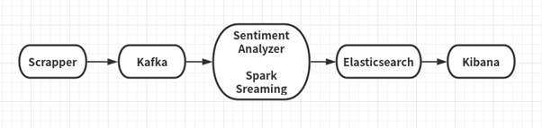

# Spark Streaming, Kafka, Sentiment analysis and Visualization in Kibana

Implemented the following framework using Apache Spark Streaming, Kafka,
Elastic, and Kibana. The framework performs SENTIMENT analysis of hash
tags in twitter data in real-time. For example, we want to do the
sentiment analysis for all the tweets for \#trump, \#coronavirus.

Figure: Sentiment analysis framework

The above framework has the following components:

## 1. Scrapper
The scrapper collects all tweets and sends them to Kafka for analytics.
The scraper is a standalone program written in PYTHON and performs the
followings:

a\. Collects tweets in real-time with particular hash tags. For example,
we

will collect all tweets with \#trump, \#coronavirus.

b\. After filtering, it send them to Kafka using Kafka API
https://kafka.apache.org/090/documentation.html\#producerapi

c\. The scrapper program runs infinitely and take hash tags as input
parameter while running.

## 2. Kafka
You need to install Kafka and run Kafka Server with Zookeeper. You
should create a dedicated channel/topic for data transport

## 3. Spark Streaming
In Spark Streaming, Kafka consumer is created that periodically collect
filtered tweets from scrapper. For each hash tag, perform sentiment
analysis using Sentiment Analyzing tool.

## 4. Sentiment Analyzer
Sentiment Analysis is the process of determining whether a piece of
writing is positive, negative, or neutral. It is also known as opinion
mining, deriving the opinion or attitude of a speaker.

For example,

"President Donald Trump approaches his first big test this week from a

position of unusual weakness." - has positive sentiment.

"Trump has the lowest standing in public opinion of any new president in

modern history." - has neutral sentiment.

"Trump has displayed little interest in the policy itself, casting it as
a

thankless chore to be done before getting to tax-cut legislation he
values

more." - has negative sentiment.

The above examples are taken from CNBC news:

<http://www.cnbc.com/2017/03/22/trumps-first-big-test-comes-as-hes-in-an-unusual-position-of-weakness.html>

nltk python library is used third for sentiment analyzing.

## 4. Elasticsearch
You need to install the Elasticsearch and run it to store the tweets and
their sentiment information for further visualization purpose.

You can point http://localhost:9200 to check if it's running.

For further information, you can refer:

<https://www.elastic.co/guide/en/elasticsearch/reference/current/getting-started.html>

## 5. Kibana
Kibana is a visualization tool that can explore the data stored in
elasticsearch. In the project, instead of directly output the result,
visualization tool is used to show the tweets sentiment classification
result in a real-time manner. Please see the documentation for more information:
[https://www.elastic.co/guide/en/kibana/current/getting-started.html](https://www.elastic.co/guide/en/kibana/current/getting-started.html)
